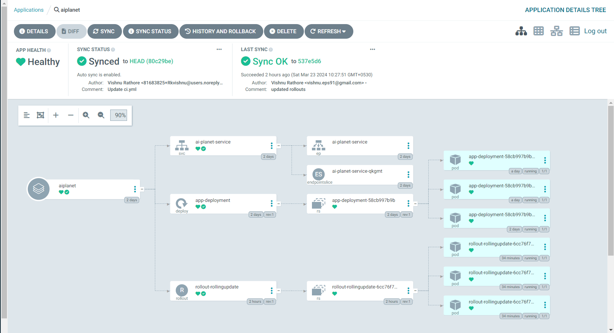
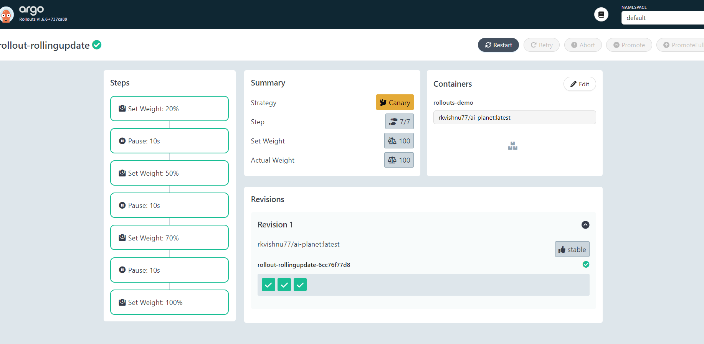

# GitOps Deployment of a Todo React App with Argo CD Rollouts

## Introduction

This README outlines the comprehensive process of deploying a Todo React application to a EKS Kubernetes cluster using GitOps practices with Argo CD.
GitOps is a methodology for deploying and managing applications on Kubernetes using Git as the single source of truth for configuration and declarative infrastructure.

##### Prerequisites:

Before proceeding with the deployment process, ensure the following prerequisites are met:

1.Familiarity with Kubernetes concepts such as Pods, Deployments, and Services. 2. Basic understanding of Docker and containerization. 3. Experience with Git for version control. 4. Access to a Kubernetes cluster for testing purposes. This could be achieved by using Minikube, kind, or a cloud provider's Kubernetes service (e.g., Amazon EKS, Google Kubernetes Engine). 5. Familiarity with Argo CD and Argo Rollouts, including their basic functionalities and concepts.

### Steps:

- Setting up the Development Environment:

1. Developed a basic Todo application using React.js, incorporating features such as adding, deleting, and marking tasks as completed.
2. Dockerized the application Todo React application using Docker.
   using `docker build -t rkvishnu77/ai-planet:latest`

3. Push the Docker image to a public container registry dockerhub

4. Setting up the Kubernetes Cluster: Created an Amazon EKS cluster with 3 nodes(t3.medium)

5. Install and configure kubectl: Installed kubectl and configure it to communicate with the newly created Amazon EKS cluster. Verified connectivity by running basic kubectl commands to query cluster information.

6. Installing Argo CD: Installed Argo CD on the EKS cluster: Used the official Argo CD documentation to install the Argo CD control plane onto the Kubernetes cluster. This involves deploying Argo CD components such as the API server, controller, and UI.

7. Accessing the Argo CD UI:Configured a load balacner on EKS CLuster to install the ArgoCD

8. Configuring Argo CD:
   8.1 Create a Git repository for the Todo React application
   8.2 Set up a Git repository (e.g., GitHub repository) to store the source code and Kubernetes manifests of the Todo React application.
   8.3 Ensuring that the repository is accessible to Argo CD for synchronization.

   8.4 Configured Argo CD for GitOps deployment: Configure Argo CD to monitor the Git repository for changes and automatically deploy updates to the Kubernetes cluster. Defined an Application custom resource in Argo CD to specify the deployment settings and synchronization parameters.

9. Creating a Continuous Integration Pipeline

 9.1 Implement a GitHub Actions workflow: Create a GitHub Actions workflow YAML file in the Git repository to automate the building and pushing of Docker images for the Todo React application. 
 9.2 Use Docker build and Docker push actions to build and push the Docker image to the specified container registry.

10. Implementing a Canary Release with Argo Rollouts

 10.1 Install Argo Rollouts on the Kubernetes cluster:  Used the official Argo Rollouts documentation to install the Argo Rollouts controller onto the Kubernetes cluster. This controller extends the capabilities of Kubernetes Deployments to support advanced deployment strategies.
 10.2 Defined a Rollout resource with a canary release strategy. For that Writen a Rollout manifest aro-rollouts.yml to define the rollout strategy for the Todo React application. Specify the canary release steps, including gradual traffic shifting and evaluation criteria.

11. Trigger a rollout: When we Make any changes to the application, such as updating the Docker image tag in the Rollout manifest. Commit and push the changes to the Git repository to trigger Argo CD synchronization. Argo CD will detect the changes and initiate the rollout process according to the defined strategy.

12. Monitoring the rollout process: Used the Argo Rollouts UI and  command-line interface (CLI) to monitor the progress of the rollout. Verify that the canary release completes successfully and meets the defined success criteria before proceeding with a full rollout.

